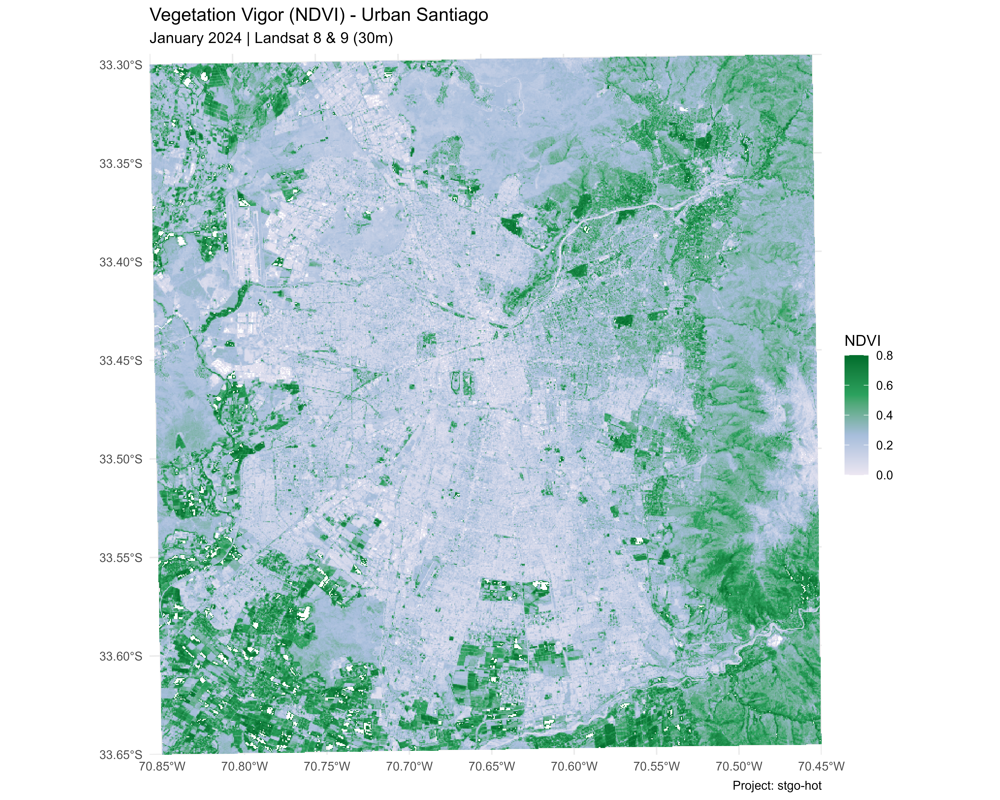
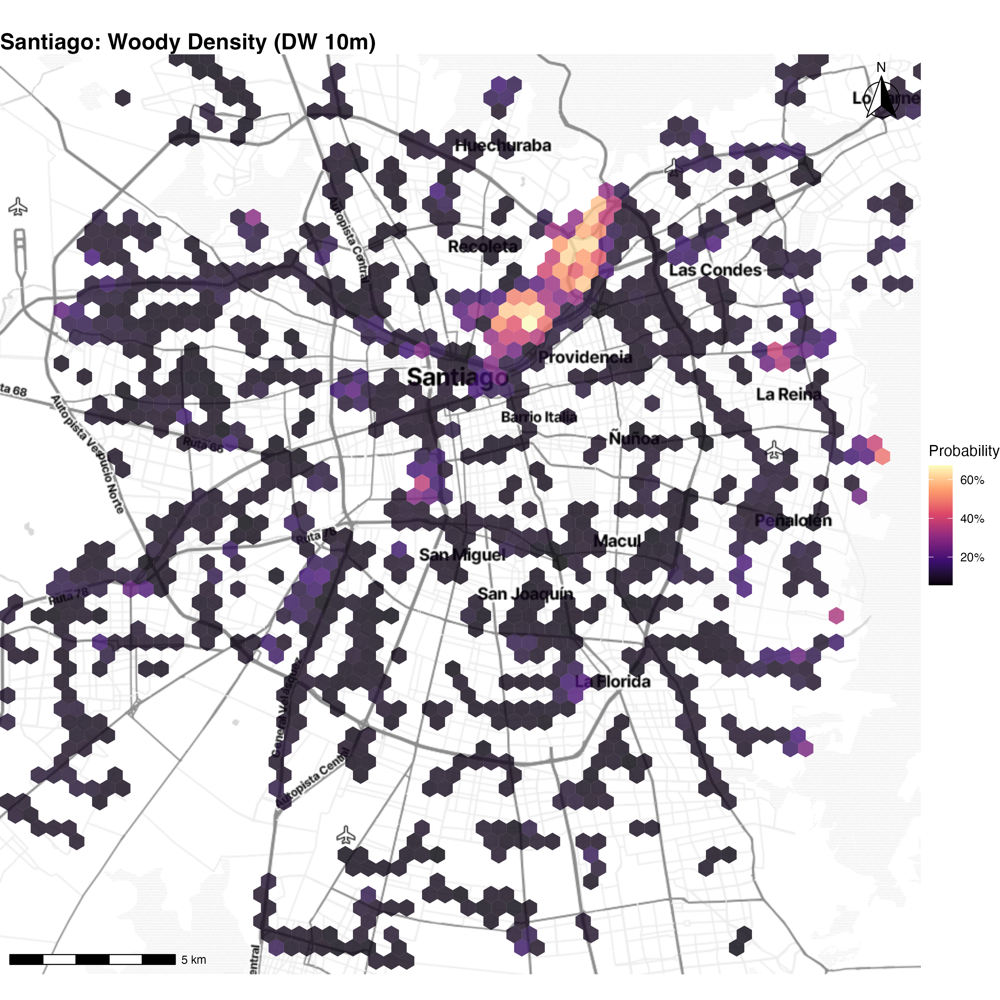
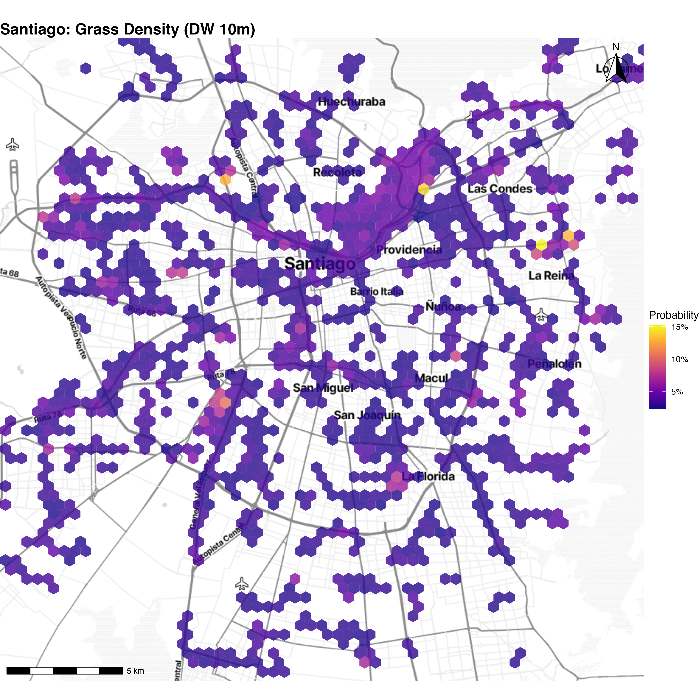
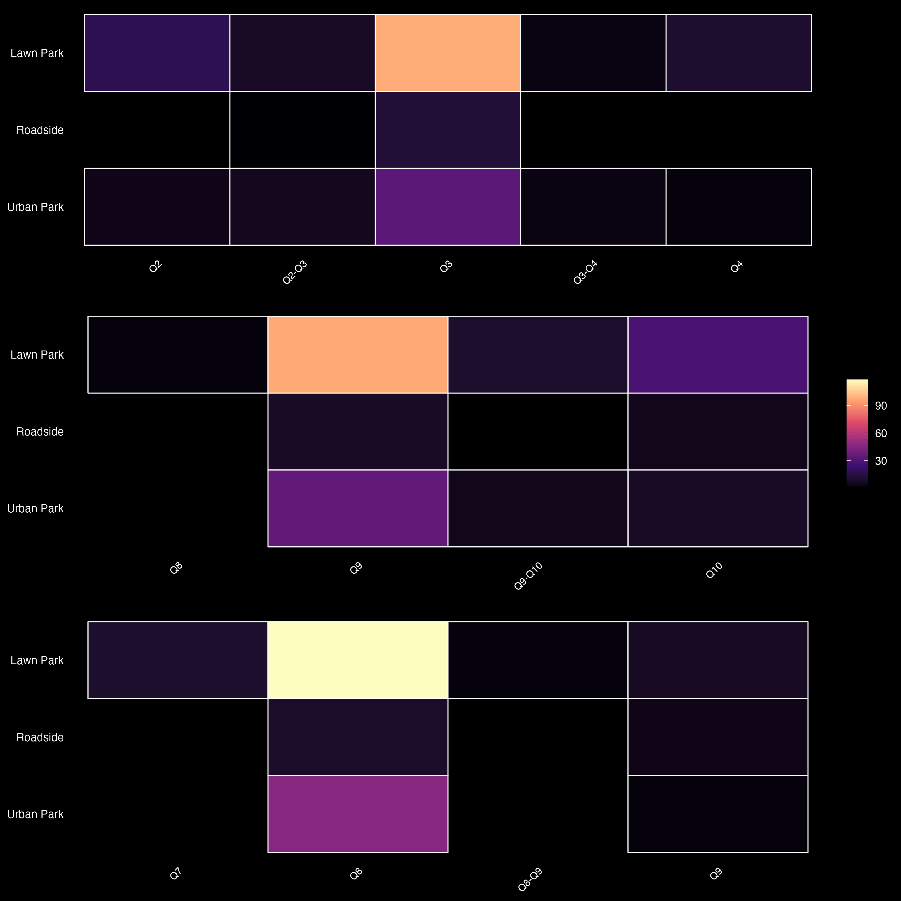
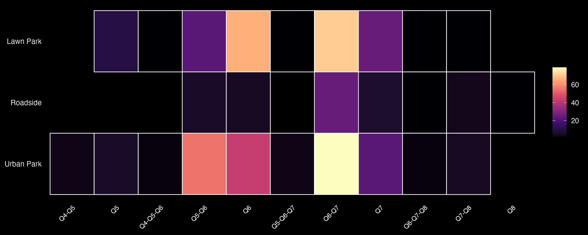
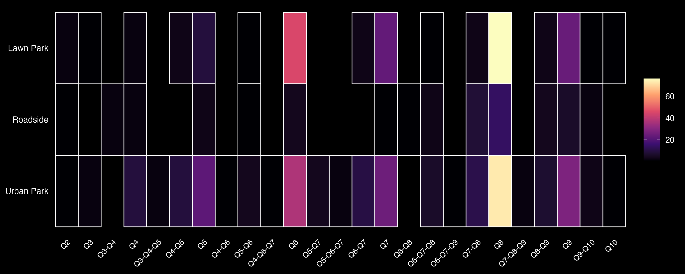
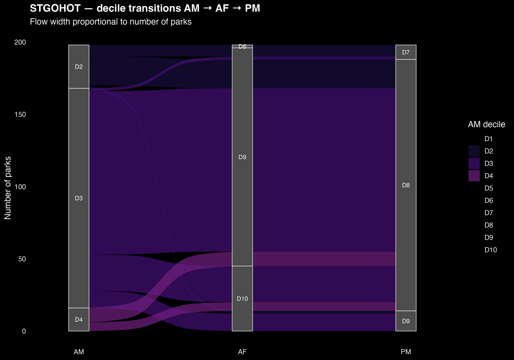
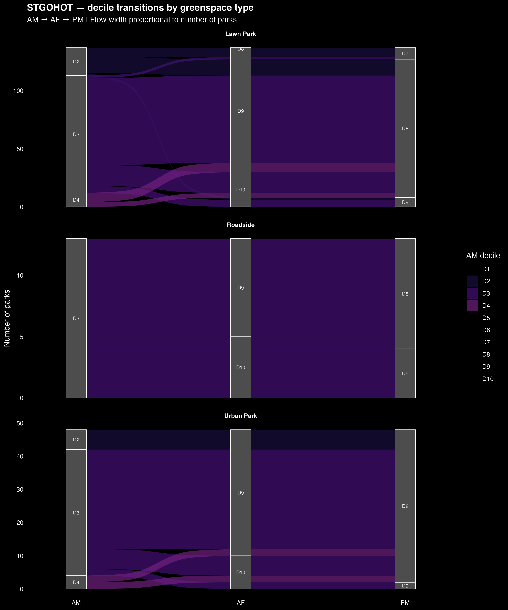

# stgohot-greenspaces

> **Urban soil sampling for climate change mitigation: prioritizing urban greenspaces by management and urban heat**  
> Urban Soil Biophysics Lab · CEDEUS / Pontificia Universidad Católica de Chile  
> Funded by Vicerectoría de Investigación UC

---

## Conceptual framework


Urban greenspaces vary along two axes: **urban soil cover and management** (x-axis) and **favorable soil physical properties** (y-axis). This repository focuses on the **x-axis** — characterizing and ranking parks by vegetation structure, surface temperature, and vegetation vigor — to select contrasting sampling sites that will later reveal the y-axis soil responses (SOC/MAOC, microbial basal respiration, and soil physical properties under different urban heat and cover conditions).

---

## Objectives

### Objective 1 — Characterize vegetation structure and thermal exposure across park types
Classify all MINVU parks in the Santiago Metropolitan Region into **Urban Park**, **Lawn Park**, and **Roadside** categories. For each park, extract:
- **Woody ratio** (trees + shrubs / total vegetation) from Google Dynamic World at 10m
- **NDVI** from Landsat 8 at 30m as a vegetation vigor index
- **Surface/air temperature deciles** from SantiagoHOT (AM / AF / PM) as a thermal exposure metric

Together these define the park's position on the x-axis of the conceptual framework.

### Objective 2 — Compare thermal characterization across data sources
Evaluate whether SantiagoHOT (air temperature), Landsat 8 (LST 30m), and MODIS (LST 1km) produce consistent thermal rankings for the same parks. Quantify agreement and divergence using decile heatmaps and alluvial diagrams across park types.

### Objective 3 — Rank parks for field soil sampling and explore association with soil organic matter
Generate a stratified priority ranking combining vegetation structure (woody ratio), NDVI, and thermal exposure to select maximally contrasting sampling sites. Explore preliminary associations between the ranking variables and field measurements of organic matter (OM) from `dataset_rm_test.csv` to validate that the x-axis proxies predict soil carbon outcomes.

---

## Interactive map

🗺️ **[View the live map →](https://Urban-Soil-Biophysics.github.io/stgohot-greenspaces/)**

---

## Key outputs

### NDVI — vegetation vigor baseline



Landsat 8 & 9 NDVI (January 2024, 30m). Values from 0.2 (urban/bare soil) to 0.8 (dense canopy). Used as a complementary ranking variable alongside Dynamic World woody ratio.

---

### Vegetation structure — Dynamic World 10m

| Woody density | Grass density |
|---|---|
|  |  |

---

### Thermal comparison — SantiagoHOT / Landsat / MODIS

| Source | Resolution | Heatmap |
|---|---|---|
| SantiagoHOT (AM/AF/PM) | ~10m air temp |  |
| Landsat 8 | 30m LST |  |
| MODIS | 1km LST |  |

#### Decile transitions AM → AF → PM (SantiagoHOT)





---

## Repository structure

```
stgohot-greenspaces/
│
├── index.qmd                           # GitHub Pages interactive map
├── _quarto.yml                         # Quarto + Pages config
│
├── scripts/
│   ├── 00_gee_init.R                   # Shared GEE session helper
│   │
│   ├── NDVI/
│   │   └── 01_ndvi_visualization.R     # NDVI map from Landsat (no GEE needed)
│   │
│   ├── dynamic-world/                  # Objective 1 — vegetation structure
│   │   ├── 01_dynamic_world_data.R     # 30m city-wide DW download
│   │   ├── 02_intercept_dw_minvu.R     # 10m park-only DW download + MINVU classification
│   │   └── 03_zonal_statistics.R       # woody/grass extraction per park
│   │
│   ├── comparison-satellites/          # Objective 2 — thermal comparison
│   │   ├── STGOHOT/
│   │   │   ├── 01_load-stgohot-tif.R
│   │   │   ├── 02_intercept-stgohot-ugs.R   ← saves intercept_stgohot_summary.rds
│   │   │   ├── 03_plot_map_stgohot.R
│   │   │   └── 04_hotmap-chart-stgohot.R
│   │   ├── LANDSAT/
│   │   │   ├── 01_load-landsat-gee.R
│   │   │   ├── 02_intercept-landsat-ugs.R
│   │   │   ├── 03_plot_map_landsat.R
│   │   │   └── 04_heatmap-chart-landsat.R
│   │   └── MODIS/
│   │       ├── 01_load-modis-gee.R
│   │       ├── 02-intercept-modis-ugs.R
│   │       ├── 03-plot-map-modis.R
│   │       └── 04_hotmap-chart-modis.R
│   │
│   └── ranking/                        # Objective 3 — sampling priority + soil OM
│       ├── 04_sample_sites.R           # unified ranking (woody + NDVI + temp)
│       └── 05_soil_om_association.R    # OM ~ ranking variables exploration
│
├── data/
│   ├── geo-data/
│   │   ├── parques_urbanos_minvu.geojson
│   │   ├── sup_areas_verdes_stgo.geojson
│   │   ├── NDVI_Santiago_Jan2024_30m.tif
│   │   └── dataset_rm_test.csv         # field OM measurements
│   ├── stgo-hot/                       # SantiagoHOT tif files (AM/AF/PM)
│   ├── stgo_dw/                        # Dynamic World 10m rasters
│   ├── processed/                      # intermediate rds files
│   └── results/                        # final CSVs and rds
│       ├── unified_park_ranking.csv    # master ranking layer
│       ├── ranking_global.csv
│       ├── ranking_urban_parks.csv
│       ├── ranking_lawn_parks.csv
│       ├── ranking_by_condition.csv
│       └── FIELD_SAMPLING_FINAL_REPORT.csv
│
├── plots/                              # static figures
└── outputs/
    └── comparison-satellites/
        ├── STGOhot/
        ├── LANDSAT/
        └── MODIS/
```

---

## Execution order

```
# Step 1 — Vegetation structure (requires GEE)
scripts/dynamic-world/02_intercept_dw_minvu.R
scripts/dynamic-world/03_zonal_statistics.R           → ugs_analysis_10m_utm.rds

# Step 2 — NDVI (no GEE — reads committed tif)
scripts/NDVI/01_ndvi_visualization.R                  → plots/map_ndvi_santiago.png

# Step 3 — Thermal deciles (no GEE — reads committed tif)
scripts/comparison-satellites/STGOHOT/01_load-stgohot-tif.R
scripts/comparison-satellites/STGOHOT/02_intercept-stgohot-ugs.R  → intercept_stgohot_summary.rds

# Step 4 — Thermal comparison (requires GEE)
scripts/comparison-satellites/LANDSAT/01_load-landsat-gee.R
scripts/comparison-satellites/MODIS/01_load-modis-gee.R

# Step 5 — Ranking (reads from disk — no GEE needed)
scripts/ranking/04_sample_sites.R                     → unified_park_ranking.rds

# Step 6 — Soil OM association (reads committed csv)
scripts/ranking/05_soil_om_association.R              → plots/05_om_association_*.png

# Step 7 — Interactive map
quarto::quarto_render("index.qmd")
```

---

## Data sources

| Source | Description | Date |
|---|---|---|
| [SantiagoHOT](https://www.stgohot.cl) | High-res air temp rasters (AM / AF / PM) | Jan 20, 2024 |
| [Google Dynamic World v1](https://developers.google.com/earth-engine/datasets/catalog/GOOGLE_DYNAMICWORLD_V1) | 10m land cover probabilities | Jan 2024 ± 5 days |
| [Landsat 8 C2 T1 L2](https://developers.google.com/earth-engine/datasets/catalog/LANDSAT_LC08_C02_T1_L2) | LST at 30m | Jan 2024 |
| [MODIS MOD11A1](https://developers.google.com/earth-engine/datasets/catalog/MODIS_061_MOD11A1) | LST at 1km | Jan 20, 2024 |
| [MINVU Urban Parks](https://geoide.minvu.cl/server/rest/services/Catastros/Catastro_de_parques_urbanos/MapServer/0/query?where=1=1&outFields=*&f=geojson) | Urban greenspace polygons, RM | Updated 12/07/2022 |
| [Áreas Verdes Stgo](https://github.com/Saryace/seminario_sacevedo/blob/main/seminario_postulacion_fasn/datos/sup_areas_verdes_stgo.geojson) | Park condition (BUEN/MAL) | — |
| `dataset_rm_test.csv` | Field OM measurements, Santiago RM | 2024 |

---

## GEE setup

```r
library(rgee)
ee_Authenticate(user = "your_username")
ee_Initialize(
  user       = "your_username",
  project    = "your-gee-project",
  drive      = TRUE,
  asset_root = "projects/earthengine-legacy/assets/users/your_username"
)
```

All GEE scripts source `scripts/00_gee_init.R` which handles session re-initialization automatically.

---

## Citation

Sara Acevedo · Urban Soil Biophysics Lab · CEDEUS / PUC Chile  
README structure inspired by [UHI-Detector](https://github.com/isatyamks/UHI-Detector) by Satyam Kumar.
